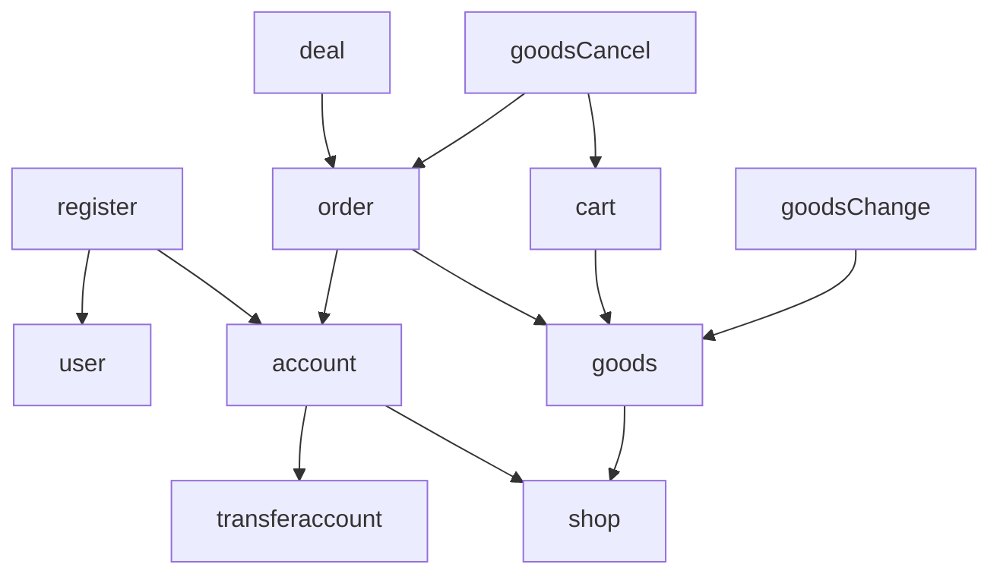

# 小组分工
后端
开发：张文擘
测试：侯斌洋
部署：徐晗宁
前端
开发：徐晗宁、侯斌洋

# 实验设计
## 类的设计
spring装填关系图：（service层）

类图：

在项目-lab3-e-shopping-class graph中有uml源文件
以user,shop,transferAccount类为最底层类，其余类在此基础上完成
共四个层级，层级分明，减少交叉调用情况

## 代码风格说明
- 数据库命名
下划线
- 后端java代码
包，变量，方法名：小驼峰
类，接口：大驼峰
- 前端代码
变量名，页面名：大驼峰
方法：小驼峰

## 测试用例
- 同一账户先注册后登录
    - 注册失败后是否能登录
    - 相同的用户名、过长过短的用户名/密码等
    - 只含数字的密码/含.却不含-_的密码
    - 虚构手机号及电子邮箱
    - 身份证号测试用例包含了随机前六位模拟不存在的省市县，出生年月检测了200年前出生或2024年出生以及平闰年二月份天数差异，最后一位通过身份证的核验规则检查整体是否有误

- 商家/顾客申请开店
    - 过长/过短的商户名称类别等表单
    - 中英文
    - 未注册用户身份证
    - 已开店用户身份证
    - 其余身份证规则同上
    - 过低过高的注册资金，三位小数注册资金
- 管理员批准开店
    - 批准已通过/拒绝的店铺
    - 批准不存在的店铺
    - 多次点击同一商铺
- 展示界面
    - 较长表单展示
- 访问无权限的页面
- 修改密码用户名 重复 不合规则 与之前相同
- 充值 大数字 小数 负数 字母
- 注销未完成订单的商店 同时查看购物车是否失效
- 删除商品
- 删除购物车
- 批准不合法商店删除
- 批准商品修改
- 查看单个商品详情页
- 查看店铺所有商品

# 问题及解决⽅案

# 代码检查结果

# 缺陷管理
## 后端
- （严重，优先）数据库中没有使用触发器、外键等成熟工具，取而代之使用手动判断方法。不安全、不稳定。
- 由于数据库写入不同步，在后阶段数据库写入抛出错误时，无法撤回之前的写入操作。目前采取办法是尽可能先判断写入条件是否满足，减少错误抛出可能性
- （较为严重）需要记录商品版次，如果用户加入购物车后，在付款前瞬间商家修改商品，会导致用户无法收到及时反馈
- token一旦设定无法修改过期时间，无法在只用一个token的情况下实现用户每步操作刷新token时间
- jar包无法运行
- 各种金额double应只保留两位小数
## 前端
- 服务器上刷新页面或输入url直接访问页面，会报404

# Tag截图

# 心得体会
## 张文擘
后端迭代越来越乱，在屎山的路上一去不回
如果有更多时间要对代码重构，在函数内部抽离工具函数和其他业务部分
要将service controller包内不同函数做分类，更有条理
（原来多一个写代码的人lab能轻松这么多）
## 徐晗宁
前端：前期规划比较失败，导致每次添加新需求的时候都要对之前的代码做很大改动，很麻烦也很打击积极性。
部署：把整个项目部署上了服务器，但nginx跳转报404的问题还没得到解决，如果刷新或直接输入uri访问的话会报404。已知原因为刷新页面时会根据浏览器上的url去nginx上请求对应的静态资源，nginx根据location / 的匹配规则在dist文件夹里找不到对应的静态文件。尚不明确如何解决。
u1s1这个lab的任务量有点太大了，代码量大就不说了，测试也需要花很长的时间，希望助教老师们能仁慈一点，放接下来期末月的学生们一条生路，好人一生平安。
## 王骁勇
在软工lab里投入的时间确实太少了，另外两位同学的压力太大，非常抱歉拖后腿了。下一次lab会认真完成自己的任务的。
